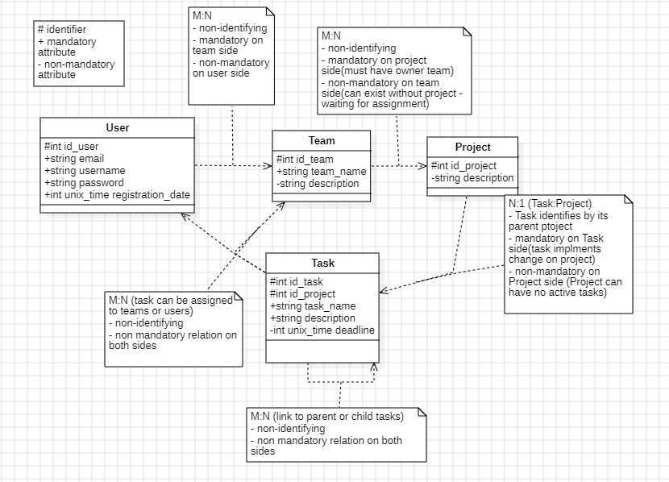

# Project constraints
## Version system CI
### Step 1: Create a New Branch
Before adding any feature or fixing any bug, create a new branch.

    git checkout -b [branch_name]
Naming Convention: feature/feature_name or bugfix/bug_name
### Step 2: Make Changes
Make changes to the code. You can see the changes with:

    git status

### Step 3: Stage and Commit Changes
Stage the changes you made.

    git add *
Now commit these changes.

    git commit
### Step 4: Push to GitHub
Push your branch to GitHub.

    git push origin [branch_name]
### Step 5: Create a Pull Request (PR)
Go to your repository on GitHub and click on New Pull Request. Choose your branch to merge into the main branch. Fill in the pull request details and click Create Pull Request.
### Step 6: Review and Merge
After review, if the changes are fine, merge the pull request.
Notes

    Never push directly to the main branch.
    If conflicts occur during PR, resolve them before merging.
### FAQ
How to update my local main branch?

    git checkout main
    git pull origin main
How to update the feature branch?

    git merge main
## Entity relational UML schema
Following is a schema that represents relations between entities, their member attributes and identifier inheritance

This implies the abstraction that both Frontend and backend has to work with